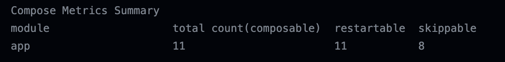

# Android Compose Compiler Metrics Action

GitHub Action that prints compose compiler metrics reports.



<br>

## Getting Started

Add the following action to your GitHub Actions workflow.

```yml
- name: Compose Metrics
  uses: lhoyong/android-compose-metrics-action@v1
  with:
    # set compose metrics directory.
    # see project root/build.gradle.kts
    directory: 'compose_metrics' # required
```

<br>

## Usage

```yml
name: Build
on:
  push:

jobs:
  build:
    runs-on: ubuntu-latest
    steps:
      - uses: actions/checkout@v3

      - name: set up JDK 11
        uses: actions/setup-java@v3
        with:
          distribution: adopt
          java-version: 11

      - name: Build
        run: ./gradlew assembleDebug -Papp.enableComposeCompilerReports=true

      - name: Compose Metrics
        uses: lhoyong/android-compose-metrics-action@v1
        with:
          directory: 'compose_metrics' # see sample project app/build.gradle.kts
```
#### Note

The workflow must contain the compose compiler plugin prior to running the compose metrics action

<br>